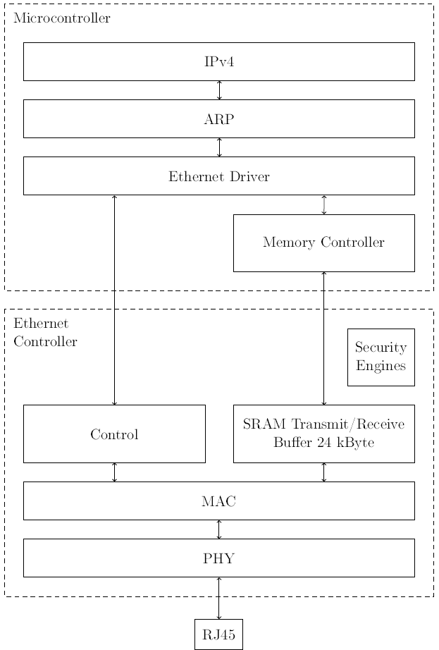

# EthernetDevBoard.X

**Hard- and software platform with its own TCP/IP stack on a PIC18F microcontroller**  
**More documentation can be found here:**

[Doxygen](https://stgloorious.github.io/EthernetDevBoard.X/)  
[CircuitMaker Project](https://circuitmaker.com/Projects/Details/Stefan-Gloor/Ethernet-Development-Board)  
[Github](https://github.com/stgloorious/EthernetDevBoard.x)  
[Theory of Operation](https://github.com/stgloorious/EthernetDevBoard.X/raw/master/docs/theory/theoryOfOperation.pdf)

## Introduction

I created this Ethernet Development Board
as a learning platform for myself to develop network-enabled hardware
and software. It offers a stand-alone solution with an 100Base-TX Ethernet Controller (ENC424J600) 
which can be used in conjuction with the on-board microcontroller (PIC18F25K50). 
Alternatively, the board can also be used as a daughterboard for an Altera DE0-nano FPGA board 
to add 100Base-TX Ethernet functionalities to it.

To really understand what's going on I wanted to create as much as possible from scratch.
Currently I'm working on the microcontroller part, the FPGA functionality is unused.

## General overview

This block diagram shows the basic theory of operation of this board. The Ethernet controller takes care of the access 
of the media as well as basic MAC functions (e.g. address insertion, CRC checksum check) in hardware. It also offers an integrated memory which
is used to store incoming as well as outgoing Ethernet packets. The upper-layer protocols, such as ARP and IP are implemented in the 
microcontroller's software.

